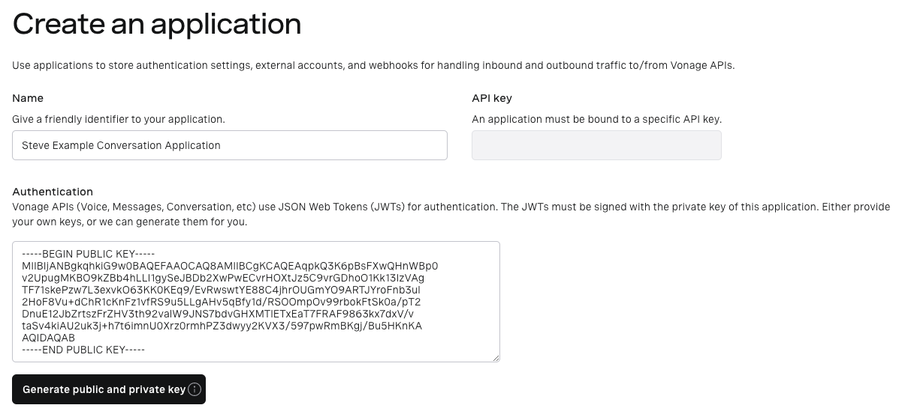
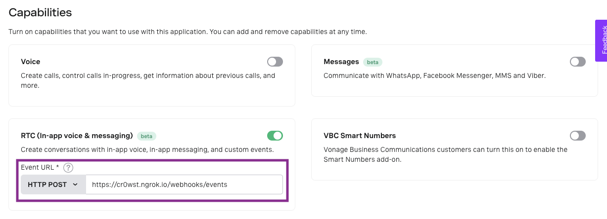

# Vonage Conversation API Demo

This application demonstrates how the [Vonage Conversation API](https://developer.nexmo.com/conversation/overview) works.

The `AutomaticConversation` class has two components to it.

## Automatically Create a Conversation and Users

The `setup` method creates a conversation and 5 users. It then creates a member relationship between the users and the conversation:

```kt
@EventListener
fun setup(contextRefreshedEvent: ContextRefreshedEvent) {
    log.info("Creating new Conversation")
    conversation = conversationService.createConversation()
    log.info("Created: $conversation")

    repeat(5) {
        log.info("Creating new User")
        val user = userService.createUser()
        users.add(user)
        log.info("Created: $user")

        log.info("Adding ${user.id} to ${conversation?.id}")
        val membership = membershipService.createMembership(user, conversation!!)
        memberships.add(membership)
    }
}
```

While the application is running, there is a scheduled task that sends a text event from a random user into the conversation. This occurs every 5 seconds:

```kt
@Scheduled(fixedDelay = 5000)
fun haveConversation() {
    try {
        if (conversation != null && memberships.isNotEmpty()) {
            val member = memberships.random()
            eventService.sendMessage(conversation!!, member)
            log.info("Sent message from ${member.id} to ${conversation!!.id}")
        }
    } catch (e: Exception) {
        // Ignore any exceptions, sometimes a race condition happens or we send too fast for Nexmo.
    }
}
```

When the application is shut down, the `tearDown` method deletes the created conversation and users:

```kt
@PreDestroy
fun tearDown() {
    log.info("Deleting all Conversations")
    conversationService.deleteConversation(conversation!!)
    log.info("Deleting all users")
    userService.deleteUsers(users)
}
```

## Pre-Setup

If you don't already have a Vonage account you can [Sign-Up](https://dashboard.nexmo.com/sign-up) and receive some free credit. You'll need to know your API Key and Secret.

You also need to create a [Vonage Application](https://developer.nexmo.com/application/overview). This can be done either via the [Vonage Dashboard](https://dashboard.nexmo.com/applications/new) or the [Vonage CLI](https://developer.nexmo.com/application/nexmo-cli)

This is an example of the application that I have created. I also opted to have Vonage generate the public and private key. You will need the path of the private key later.



Also, enable the RTC capability and define your event url. You'll need to expose your application to the internet via something like [ngrok](https://ngrok.com).

There is an event webhook controller listening on `{baseUrl}/webhook/events`:



You will use this application's ID in the setup.

## Setup

Define the following in `src/main/resources/application.properties`:

```properties
nexmo.creds.api-key=your-api-key
nexmo.creds.secret=your-secret
nexmo.creds.private-key-paty=/path/to/your/private.key
nexmo.creds.application-id=your-application-id
```

## Start the Application

The following command can be used to start the application:

```sh
./mvnw spring-boot:run
```